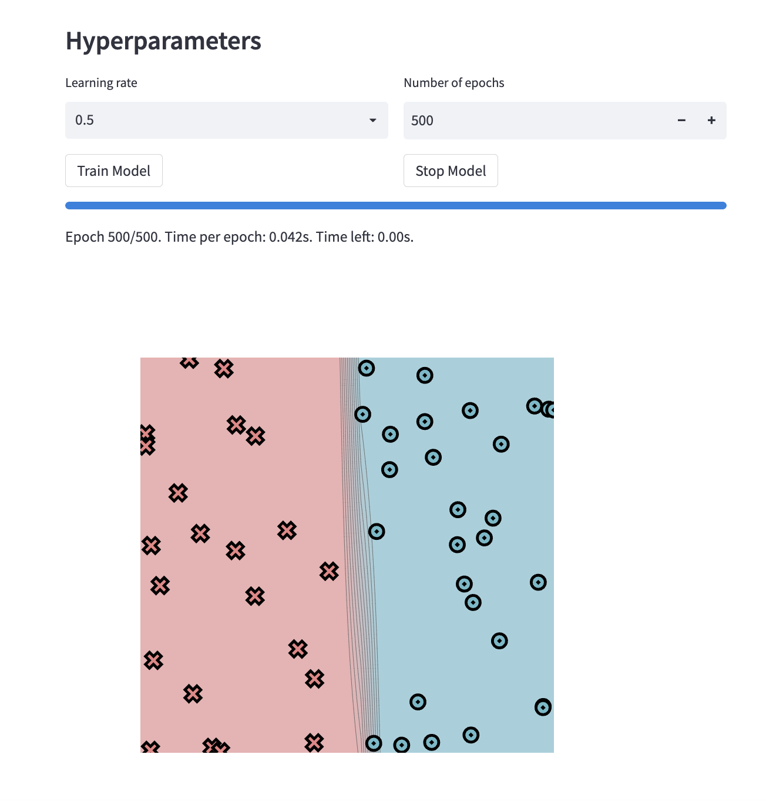
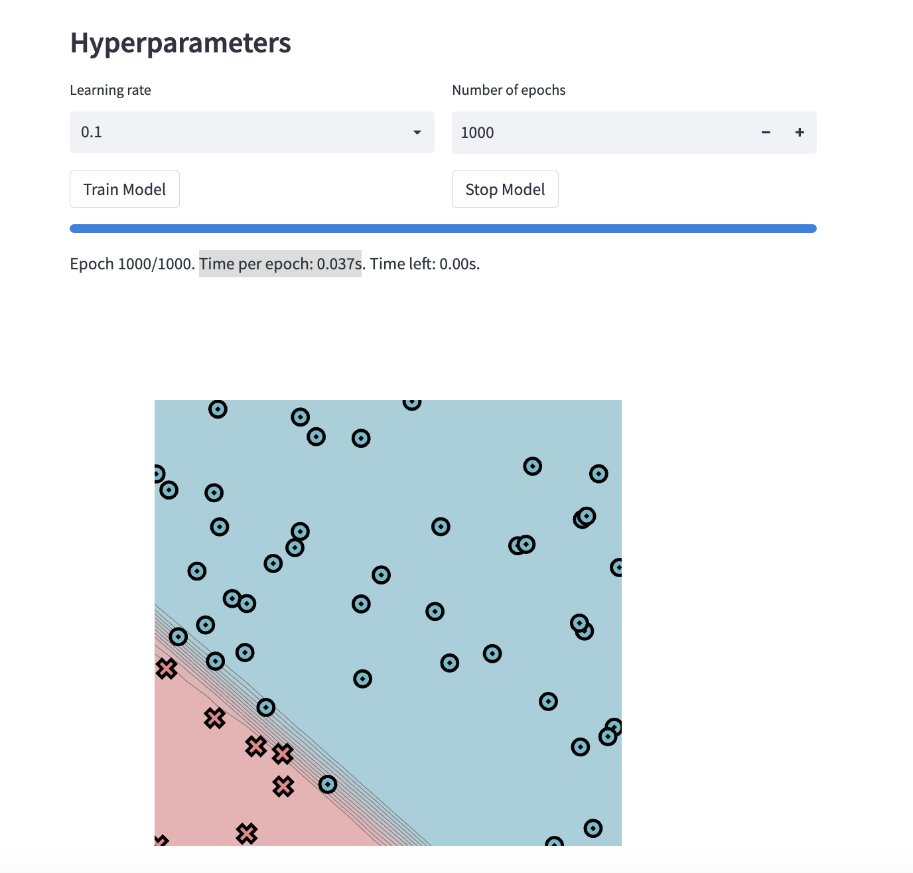
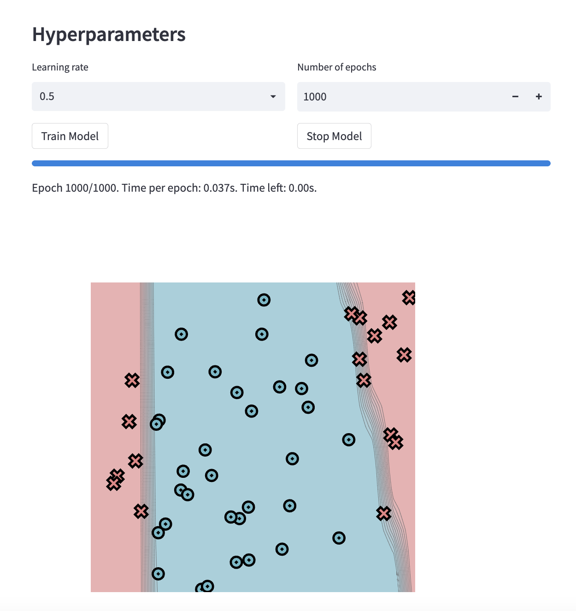
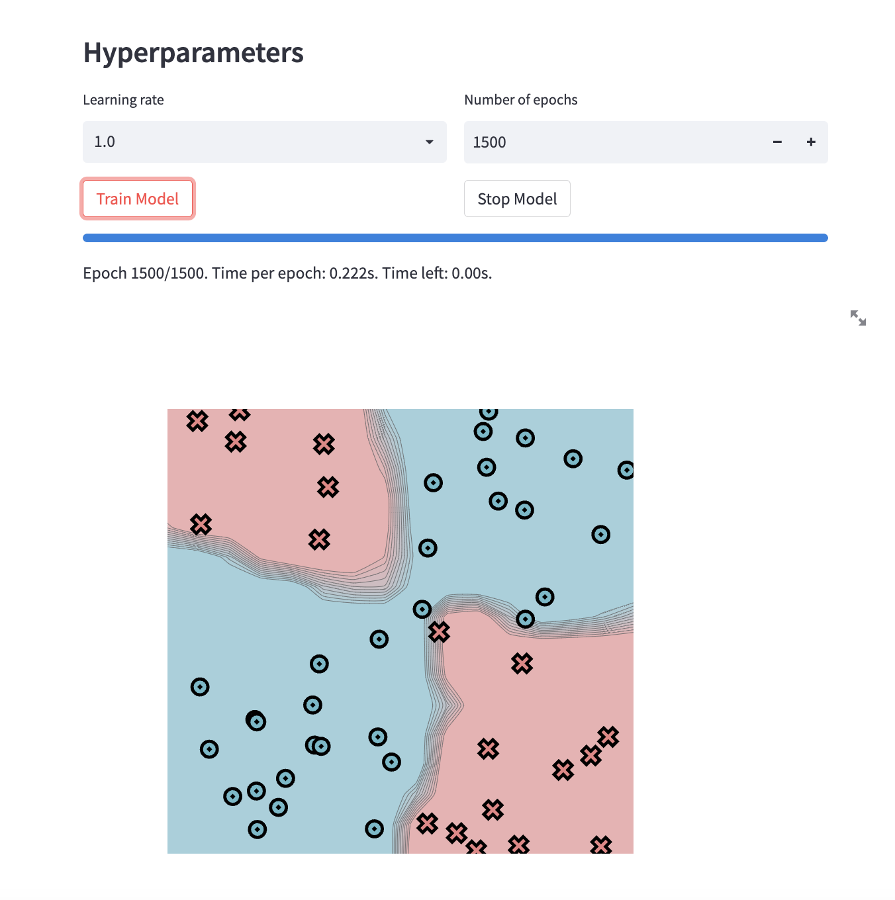

[](https://classroom.github.com/a/YFgwt0yY)

# MiniTorch Module 2


- Docs: https://minitorch.github.io/

- Overview: https://minitorch.github.io/module2/module2/

This assignment requires the following files from the previous assignments. You can get these by running

```bash
python sync_previous_module.py previous-module-dir current-module-dir
```

The files that will be synced are:

        minitorch/operators.py minitorch/module.py minitorch/autodiff.py minitorch/scalar.py minitorch/scalar_functions.py minitorch/module.py project/run_manual.py project/run_scalar.py project/datasets.py

Simple: Time per epoch: 0.042s.



Epoch: 0/500, loss: 0, correct: 0
Epoch: 10/500, loss: 34.06555825184702, correct: 28
Epoch: 20/500, loss: 33.776528669764176, correct: 28
Epoch: 30/500, loss: 33.06192524000736, correct: 28
Epoch: 40/500, loss: 30.997128344584215, correct: 39
Epoch: 50/500, loss: 24.981527565148802, correct: 45
Epoch: 0/500, loss: 0, correct: 0
Epoch: 60/500, loss: 14.667041786706053, correct: 47
Epoch: 70/500, loss: 7.693389383668345, correct: 50
Epoch: 80/500, loss: 4.927148717006667, correct: 50
Epoch: 90/500, loss: 3.488475188089574, correct: 50
Epoch: 100/500, loss: 2.677311261113397, correct: 50
Epoch: 110/500, loss: 2.1597554762437006, correct: 50
Epoch: 120/500, loss: 1.806137439262093, correct: 50
Epoch: 130/500, loss: 1.5461799005132097, correct: 50
Epoch: 140/500, loss: 1.347932153392705, correct: 50
Epoch: 150/500, loss: 1.1927740351833178, correct: 50
Epoch: 160/500, loss: 1.067748586501544, correct: 50
Epoch: 170/500, loss: 0.9638575829305938, correct: 50
Epoch: 180/500, loss: 0.87630828567564, correct: 50
Epoch: 190/500, loss: 0.8015604134608514, correct: 50
Epoch: 200/500, loss: 0.7371724010093621, correct: 50
Epoch: 210/500, loss: 0.6809749162956688, correct: 50
Epoch: 220/500, loss: 0.6316367149600478, correct: 50
Epoch: 230/500, loss: 0.5880977044292479, correct: 50
Epoch: 240/500, loss: 0.5492805317603301, correct: 50
Epoch: 250/500, loss: 0.5145842884981077, correct: 50
Epoch: 260/500, loss: 0.4836197381265206, correct: 50
Epoch: 270/500, loss: 0.4556410931429779, correct: 50
Epoch: 280/500, loss: 0.43027160433778033, correct: 50
Epoch: 290/500, loss: 0.4071805425822678, correct: 50
Epoch: 300/500, loss: 0.3860578398089251, correct: 50
Epoch: 310/500, loss: 0.36672768541682643, correct: 50
Epoch: 320/500, loss: 0.3489232045797117, correct: 50
Epoch: 330/500, loss: 0.3325142552165426, correct: 50
Epoch: 340/500, loss: 0.31745490255375086, correct: 50
Epoch: 350/500, loss: 0.30351052598278855, correct: 50
Epoch: 360/500, loss: 0.29056285795687825, correct: 50
Epoch: 370/500, loss: 0.2786101601168559, correct: 50
Epoch: 380/500, loss: 0.2674749370034895, correct: 50
Epoch: 390/500, loss: 0.2570732933513904, correct: 50
Epoch: 400/500, loss: 0.24730627963445498, correct: 50
Epoch: 410/500, loss: 0.23813902987515087, correct: 50
Epoch: 420/500, loss: 0.22953368133897417, correct: 50
Epoch: 430/500, loss: 0.22141783559224787, correct: 50
Epoch: 440/500, loss: 0.21376765590822358, correct: 50
Epoch: 450/500, loss: 0.20655685037968458, correct: 50
Epoch: 460/500, loss: 0.1997303189773403, correct: 50
Epoch: 470/500, loss: 0.19327150407995014, correct: 50
Epoch: 480/500, loss: 0.18716114273158227, correct: 50
Epoch: 490/500, loss: 0.181358099513629, correct: 50
Epoch: 500/500, loss: 0.1758568133466356, correct: 50

Diag: Time per epoch: 0.037s



Epoch: 0/1000, loss: 0, correct: 0
Epoch: 10/1000, loss: 23.51782287737501, correct: 43
Epoch: 20/1000, loss: 21.23679397836876, correct: 43
Epoch: 30/1000, loss: 20.13921021512607, correct: 43
Epoch: 40/1000, loss: 19.099935375288652, correct: 43
Epoch: 50/1000, loss: 17.954788077066443, correct: 43
Epoch: 60/1000, loss: 17.174825480332874, correct: 43
Epoch: 70/1000, loss: 16.805957995416094, correct: 43
Epoch: 80/1000, loss: 16.434330246381897, correct: 43
Epoch: 90/1000, loss: 16.049157014567886, correct: 43
Epoch: 100/1000, loss: 15.651412815708992, correct: 43
Epoch: 110/1000, loss: 15.249535286002486, correct: 43
Epoch: 120/1000, loss: 14.839670719988257, correct: 43
Epoch: 130/1000, loss: 14.420293128187147, correct: 43
Epoch: 140/1000, loss: 13.992702641614402, correct: 43
Epoch: 150/1000, loss: 13.558383408422088, correct: 43
Epoch: 160/1000, loss: 13.11904891697395, correct: 43
Epoch: 170/1000, loss: 12.676670000465048, correct: 43
Epoch: 180/1000, loss: 12.233475486754115, correct: 43
Epoch: 190/1000, loss: 11.79191910387225, correct: 43
Epoch: 200/1000, loss: 11.354611397135931, correct: 43
Epoch: 210/1000, loss: 10.92422169928372, correct: 43
Epoch: 220/1000, loss: 10.503361248594986, correct: 43
Epoch: 230/1000, loss: 10.094462585783507, correct: 43
Epoch: 240/1000, loss: 9.699671046819473, correct: 45
Epoch: 250/1000, loss: 9.320761326216772, correct: 45
Epoch: 260/1000, loss: 8.959086772714121, correct: 45
Epoch: 270/1000, loss: 8.629068955398854, correct: 45
Epoch: 280/1000, loss: 8.381103413390857, correct: 45
Epoch: 290/1000, loss: 8.14661514091308, correct: 46
Epoch: 300/1000, loss: 7.923903362298735, correct: 46
Epoch: 310/1000, loss: 7.712776088023091, correct: 46
Epoch: 320/1000, loss: 7.512919266356479, correct: 46
Epoch: 330/1000, loss: 7.323907031630501, correct: 47
Epoch: 340/1000, loss: 7.145236836889117, correct: 48
Epoch: 350/1000, loss: 6.9763579698544795, correct: 48
Epoch: 360/1000, loss: 6.821022910997737, correct: 48
Epoch: 370/1000, loss: 6.682039159517946, correct: 48
Epoch: 380/1000, loss: 6.555147235520351, correct: 48
Epoch: 390/1000, loss: 6.435202993870998, correct: 48
Epoch: 400/1000, loss: 6.32336861139355, correct: 48
Epoch: 410/1000, loss: 6.216317192099824, correct: 48
Epoch: 420/1000, loss: 6.11341124635985, correct: 48
Epoch: 430/1000, loss: 6.014392789312751, correct: 48
Epoch: 440/1000, loss: 5.919022681401688, correct: 49
Epoch: 450/1000, loss: 5.827077466293232, correct: 49
Epoch: 460/1000, loss: 5.738348645745771, correct: 49
Epoch: 470/1000, loss: 5.652641856422259, correct: 49
Epoch: 480/1000, loss: 5.569776021884838, correct: 49
Epoch: 490/1000, loss: 5.489582509366576, correct: 50
Epoch: 500/1000, loss: 5.411904308798741, correct: 50
Epoch: 510/1000, loss: 5.336595245511145, correct: 50
Epoch: 520/1000, loss: 5.263519233699823, correct: 50
Epoch: 530/1000, loss: 5.192549574557939, correct: 50
Epoch: 540/1000, loss: 5.123568300624279, correct: 50
Epoch: 550/1000, loss: 5.056465566221041, correct: 50
Epoch: 560/1000, loss: 4.991139082673715, correct: 50
Epoch: 570/1000, loss: 4.927493596210463, correct: 50
Epoch: 580/1000, loss: 4.865440405932557, correct: 50
Epoch: 590/1000, loss: 4.804896918959454, correct: 50
Epoch: 600/1000, loss: 4.745786239726338, correct: 50
Epoch: 610/1000, loss: 4.688036790406334, correct: 50
Epoch: 620/1000, loss: 4.63158195951133, correct: 50
Epoch: 630/1000, loss: 4.576359775869768, correct: 50
Epoch: 640/1000, loss: 4.522312605367235, correct: 50
Epoch: 650/1000, loss: 4.469386868051741, correct: 50
Epoch: 660/1000, loss: 4.417532773437674, correct: 50
Epoch: 670/1000, loss: 4.3667040720822206, correct: 50
Epoch: 680/1000, loss: 4.316857821746877, correct: 50
Epoch: 690/1000, loss: 4.267954166689714, correct: 50
Epoch: 700/1000, loss: 4.219956128855488, correct: 50
Epoch: 710/1000, loss: 4.1728294099371395, correct: 50
Epoch: 720/1000, loss: 4.126542203470824, correct: 50
Epoch: 730/1000, loss: 4.081065016294647, correct: 50
Epoch: 740/1000, loss: 4.0363704988481235, correct: 50
Epoch: 750/1000, loss: 3.99243328391343, correct: 50
Epoch: 760/1000, loss: 3.9492298335016476, correct: 50
Epoch: 770/1000, loss: 3.9067382936670665, correct: 50
Epoch: 780/1000, loss: 3.86493835709208, correct: 50
Epoch: 790/1000, loss: 3.823811133325314, correct: 50
Epoch: 800/1000, loss: 3.783339026578592, correct: 50
Epoch: 810/1000, loss: 3.7435056209962543, correct: 50
Epoch: 820/1000, loss: 3.7042955733057843, correct: 50
Epoch: 830/1000, loss: 3.6656945127438836, correct: 50
Epoch: 840/1000, loss: 3.62768894812998, correct: 50
Epoch: 850/1000, loss: 3.591164459819088, correct: 50
Epoch: 860/1000, loss: 3.5562461392214226, correct: 50
Epoch: 870/1000, loss: 3.5183865536093717, correct: 50
Epoch: 880/1000, loss: 3.483929756425592, correct: 50
Epoch: 890/1000, loss: 3.4503967701162703, correct: 50
Epoch: 900/1000, loss: 3.4156543885109167, correct: 50
Epoch: 910/1000, loss: 3.382734829927726, correct: 50
Epoch: 920/1000, loss: 3.3508788001246823, correct: 50
Epoch: 930/1000, loss: 3.3198284755920575, correct: 50
Epoch: 940/1000, loss: 3.289247197260812, correct: 50
Epoch: 950/1000, loss: 3.2591232470848643, correct: 50
Epoch: 960/1000, loss: 3.2265505324427046, correct: 50
Epoch: 970/1000, loss: 3.199001086437708, correct: 50
Epoch: 980/1000, loss: 3.168473532151787, correct: 50
Epoch: 990/1000, loss: 3.1398251071214505, correct: 50
Epoch: 1000/1000, loss: 3.112365009912747, correct: 50

Split: Time per epoch: 0.037s.



Epoch: 0/1000, loss: 0, correct: 0
Epoch: 10/500, loss: 32.14291631916999, correct: 33
Epoch: 20/500, loss: 31.82239802520813, correct: 33
Epoch: 30/500, loss: 31.471903240288093, correct: 33
Epoch: 40/500, loss: 30.89896984956598, correct: 33
Epoch: 50/500, loss: 30.005854594296125, correct: 33
Epoch: 60/500, loss: 29.150672431152604, correct: 39
Epoch: 70/500, loss: 29.167728295082792, correct: 41
Epoch: 80/500, loss: 29.062512433884365, correct: 40
Epoch: 90/500, loss: 29.014036282144463, correct: 39
Epoch: 100/500, loss: 28.85022756225544, correct: 39
Epoch: 110/500, loss: 29.16812905261656, correct: 36
Epoch: 120/500, loss: 28.74205965944855, correct: 36
Epoch: 130/500, loss: 28.421462198907854, correct: 39
Epoch: 140/500, loss: 28.236916193244287, correct: 39
Epoch: 150/500, loss: 29.087711091375702, correct: 35
Epoch: 160/500, loss: 28.30282309137978, correct: 39
Epoch: 170/500, loss: 28.3140502235852, correct: 39
Epoch: 180/500, loss: 28.32010110527018, correct: 39
Epoch: 190/500, loss: 28.31532982190453, correct: 39
Epoch: 200/500, loss: 28.308489388419826, correct: 39
Epoch: 210/500, loss: 28.088841960615078, correct: 39
Epoch: 220/500, loss: 28.02012027157518, correct: 40
Epoch: 230/500, loss: 28.156009131510128, correct: 39
Epoch: 240/500, loss: 28.21019607537914, correct: 39
Epoch: 250/500, loss: 28.170328674619544, correct: 39
Epoch: 260/500, loss: 28.158024941822983, correct: 39
Epoch: 270/500, loss: 28.14041627520699, correct: 39
Epoch: 280/500, loss: 28.13685163224228, correct: 39
Epoch: 290/500, loss: 28.135905160163922, correct: 39
Epoch: 300/500, loss: 28.13790924825935, correct: 39
Epoch: 310/500, loss: 28.13722075530052, correct: 39
Epoch: 320/500, loss: 28.138090439886653, correct: 39
Epoch: 330/500, loss: 28.140540830973702, correct: 39
Epoch: 340/500, loss: 28.14008294223976, correct: 39
Epoch: 350/500, loss: 28.12636905248273, correct: 39
Epoch: 360/500, loss: 28.12658004341793, correct: 39
Epoch: 370/500, loss: 28.12832847780585, correct: 39
Epoch: 380/500, loss: 28.131648156308927, correct: 39
Epoch: 390/500, loss: 28.13166437533306, correct: 39
Epoch: 400/500, loss: 28.132712527784843, correct: 39
Epoch: 410/500, loss: 28.131749971193088, correct: 39
Epoch: 0/500, loss: 0, correct: 0
Epoch: 10/500, loss: 31.979205143650713, correct: 33
Epoch: 20/500, loss: 31.292221979887074, correct: 33
Epoch: 30/500, loss: 30.361909834563598, correct: 33
Epoch: 40/500, loss: 28.99685238698511, correct: 34
Epoch: 50/500, loss: 27.24754764270576, correct: 43
Epoch: 60/500, loss: 25.390501694592817, correct: 43
Epoch: 70/500, loss: 23.621783331639495, correct: 43
Epoch: 80/500, loss: 22.385733875973955, correct: 43
Epoch: 90/500, loss: 29.59922887169421, correct: 33
Epoch: 100/500, loss: 25.246763108830223, correct: 36
Epoch: 110/500, loss: 23.198059269723263, correct: 39
Epoch: 120/500, loss: 22.74810735283197, correct: 39
Epoch: 130/500, loss: 23.845557559237303, correct: 37
Epoch: 140/500, loss: 21.77877085207963, correct: 40
Epoch: 150/500, loss: 20.33019814334017, correct: 43
Epoch: 160/500, loss: 21.43050032060237, correct: 40
Epoch: 170/500, loss: 25.779018974601943, correct: 36
Epoch: 180/500, loss: 20.791696728044844, correct: 40
Epoch: 190/500, loss: 19.30070994082274, correct: 43
Epoch: 200/500, loss: 20.621547026942938, correct: 40
Epoch: 210/500, loss: 27.783864647472793, correct: 36
Epoch: 220/500, loss: 19.165828335940937, correct: 43
Epoch: 230/500, loss: 17.114593783805862, correct: 44
Epoch: 240/500, loss: 17.12115213728003, correct: 44
Epoch: 250/500, loss: 39.85994255235546, correct: 33
Epoch: 260/500, loss: 18.212671498710225, correct: 43
Epoch: 270/500, loss: 16.06125139469304, correct: 44
Epoch: 280/500, loss: 15.577165227289935, correct: 44
Epoch: 290/500, loss: 59.45310477274915, correct: 33
Epoch: 300/500, loss: 23.43772130455032, correct: 39
Epoch: 310/500, loss: 15.809563568633383, correct: 44
Epoch: 320/500, loss: 15.128779916640923, correct: 44
Epoch: 330/500, loss: 14.127379070777963, correct: 44
Epoch: 340/500, loss: 19.16671772969691, correct: 43
Epoch: 350/500, loss: 15.688346528696457, correct: 43
Epoch: 360/500, loss: 14.958581284556486, correct: 43
Epoch: 370/500, loss: 13.462899876978083, correct: 43
Epoch: 380/500, loss: 84.95284547491441, correct: 31
Epoch: 390/500, loss: 32.75676590659439, correct: 33
Epoch: 400/500, loss: 32.054231286740084, correct: 33
Epoch: 410/500, loss: 32.05171625070761, correct: 33
Epoch: 420/500, loss: 32.051674598977385, correct: 33
Epoch: 430/500, loss: 32.05167390644568, correct: 33
Epoch: 440/500, loss: 32.051673894453316, correct: 33
Epoch: 450/500, loss: 32.05167389418431, correct: 33
Epoch: 460/500, loss: 32.05167389417079, correct: 33
Epoch: 470/500, loss: 32.05167389416938, correct: 33
Epoch: 480/500, loss: 32.05167389416921, correct: 33
Epoch: 490/500, loss: 32.05167389416921, correct: 33
Epoch: 500/500, loss: 32.05167389416921, correct: 33
Epoch: 10/1000, loss: 31.507366222920915, correct: 33
Epoch: 20/1000, loss: 30.720800730317436, correct: 33
Epoch: 30/1000, loss: 29.63619024746862, correct: 33
Epoch: 40/1000, loss: 28.69899281064597, correct: 39
Epoch: 50/1000, loss: 28.129893456745172, correct: 40
Epoch: 60/1000, loss: 27.671901326976815, correct: 41
Epoch: 70/1000, loss: 27.188731382074767, correct: 42
Epoch: 80/1000, loss: 26.67365841758774, correct: 42
Epoch: 90/1000, loss: 26.359755899746755, correct: 43
Epoch: 100/1000, loss: 25.721589349204745, correct: 42
Epoch: 110/1000, loss: 25.28873406674062, correct: 43
Epoch: 120/1000, loss: 24.67217817480792, correct: 43
Epoch: 130/1000, loss: 29.179567350722362, correct: 36
Epoch: 140/1000, loss: 25.157631791806136, correct: 43
Epoch: 150/1000, loss: 24.850575181571376, correct: 42
Epoch: 160/1000, loss: 24.80362604410315, correct: 42
Epoch: 170/1000, loss: 24.256707445646857, correct: 42
Epoch: 180/1000, loss: 23.79753297201508, correct: 43
Epoch: 190/1000, loss: 23.36332183753887, correct: 43
Epoch: 200/1000, loss: 23.064910173999007, correct: 43
Epoch: 210/1000, loss: 20.92688574036796, correct: 44
Epoch: 220/1000, loss: 20.052865734777818, correct: 44
Epoch: 230/1000, loss: 19.839209450972202, correct: 44
Epoch: 240/1000, loss: 20.06568709221031, correct: 43
Epoch: 250/1000, loss: 19.98027010054334, correct: 43
Epoch: 260/1000, loss: 19.824246479505238, correct: 43
Epoch: 270/1000, loss: 19.61207771898798, correct: 43
Epoch: 280/1000, loss: 19.344774897990924, correct: 43
Epoch: 290/1000, loss: 18.151858340677336, correct: 44
Epoch: 300/1000, loss: 17.987658941782986, correct: 44
Epoch: 310/1000, loss: 17.910258106180112, correct: 44
Epoch: 320/1000, loss: 17.784215900339916, correct: 44
Epoch: 330/1000, loss: 17.64993849838, correct: 44
Epoch: 340/1000, loss: 17.502778405019573, correct: 44
Epoch: 350/1000, loss: 17.282732145294084, correct: 44
Epoch: 360/1000, loss: 17.105797383699347, correct: 44
Epoch: 370/1000, loss: 16.90510597012648, correct: 44
Epoch: 380/1000, loss: 16.677943825955385, correct: 44
Epoch: 390/1000, loss: 16.422498558494016, correct: 44
Epoch: 400/1000, loss: 16.13752396570139, correct: 44
Epoch: 410/1000, loss: 15.82240124352749, correct: 44
Epoch: 420/1000, loss: 15.475799762926789, correct: 44
Epoch: 430/1000, loss: 15.088380586511782, correct: 44
Epoch: 440/1000, loss: 14.628414077052227, correct: 44
Epoch: 450/1000, loss: 14.018045330290395, correct: 44
Epoch: 460/1000, loss: 13.123479043398422, correct: 44
Epoch: 470/1000, loss: 12.136287936233538, correct: 44
Epoch: 480/1000, loss: 11.212484193668102, correct: 45
Epoch: 490/1000, loss: 10.400437385295161, correct: 46
Epoch: 500/1000, loss: 47.4869768695856, correct: 33
Epoch: 510/1000, loss: 13.088132360102273, correct: 47
Epoch: 520/1000, loss: 8.50870033047909, correct: 49
Epoch: 530/1000, loss: 8.465989178737054, correct: 49
Epoch: 540/1000, loss: 16.51986011088844, correct: 42
Epoch: 550/1000, loss: 7.73774532440302, correct: 48
Epoch: 560/1000, loss: 20.569537600279446, correct: 40
Epoch: 570/1000, loss: 8.513077079437792, correct: 48
Epoch: 580/1000, loss: 7.876793508678145, correct: 48
Epoch: 590/1000, loss: 26.86148601849465, correct: 38
Epoch: 600/1000, loss: 5.7610994860316, correct: 50
Epoch: 610/1000, loss: 6.226275681836527, correct: 48
Epoch: 620/1000, loss: 19.040611985809488, correct: 39
Epoch: 630/1000, loss: 4.996236125162949, correct: 50
Epoch: 640/1000, loss: 4.620099517445513, correct: 50
Epoch: 650/1000, loss: 7.335265120430426, correct: 46
Epoch: 660/1000, loss: 13.641282559919581, correct: 40
Epoch: 670/1000, loss: 4.409994485339619, correct: 50
Epoch: 680/1000, loss: 4.557931200902479, correct: 50
Epoch: 690/1000, loss: 7.154986933691743, correct: 46
Epoch: 700/1000, loss: 8.482682320111106, correct: 46
Epoch: 710/1000, loss: 4.306445510111405, correct: 50
Epoch: 720/1000, loss: 3.538531280445442, correct: 50
Epoch: 730/1000, loss: 3.666075658604449, correct: 50
Epoch: 740/1000, loss: 8.556935957217291, correct: 46
Epoch: 750/1000, loss: 3.4289824910593434, correct: 50
Epoch: 760/1000, loss: 2.529706725782744, correct: 50
Epoch: 770/1000, loss: 2.271197126953312, correct: 50
Epoch: 780/1000, loss: 2.0995380120555365, correct: 50
Epoch: 790/1000, loss: 1.9532658270903849, correct: 50
Epoch: 800/1000, loss: 1.8249581923059095, correct: 50
Epoch: 810/1000, loss: 1.71106526016522, correct: 50
Epoch: 820/1000, loss: 1.6092936053316733, correct: 50
Epoch: 830/1000, loss: 1.5178596076850235, correct: 50
Epoch: 840/1000, loss: 1.435320946574721, correct: 50
Epoch: 850/1000, loss: 1.3604906081602346, correct: 50
Epoch: 860/1000, loss: 1.292379131067528, correct: 50
Epoch: 870/1000, loss: 1.2301536153311654, correct: 50
Epoch: 880/1000, loss: 1.1745086130134965, correct: 50
Epoch: 890/1000, loss: 1.1233778250548676, correct: 50
Epoch: 900/1000, loss: 1.0760840532468945, correct: 50
Epoch: 910/1000, loss: 1.032174518261058, correct: 50
Epoch: 920/1000, loss: 0.9913095558731078, correct: 50
Epoch: 930/1000, loss: 0.9531988818584612, correct: 50
Epoch: 940/1000, loss: 0.9176081591819735, correct: 50
Epoch: 950/1000, loss: 0.8846277003435795, correct: 50
Epoch: 960/1000, loss: 0.8538366424103324, correct: 50
Epoch: 970/1000, loss: 0.8250957382738839, correct: 50
Epoch: 980/1000, loss: 0.7980335510297427, correct: 50
Epoch: 990/1000, loss: 0.7724783333411583, correct: 50
Epoch: 1000/1000, loss: 0.7483152272687497, correct: 50

Xor: Time per epoch: 0.223s.



Epoch: 0/1500, loss: 0, correct: 0
Epoch: 10/1500, loss: 28.19471142652052, correct: 35
Epoch: 20/1500, loss: 28.679272146870108, correct: 32
Epoch: 30/1500, loss: 22.309922235424906, correct: 39
Epoch: 40/1500, loss: 18.569307630687433, correct: 43
Epoch: 50/1500, loss: 12.826972725183886, correct: 46
Epoch: 60/1500, loss: 9.228395193140152, correct: 48
Epoch: 70/1500, loss: 9.413262677394478, correct: 46
Epoch: 80/1500, loss: 7.608317617249082, correct: 48
Epoch: 90/1500, loss: 6.629659124041397, correct: 48
Epoch: 100/1500, loss: 7.536753639309996, correct: 46
Epoch: 110/1500, loss: 8.612170156214962, correct: 45
Epoch: 120/1500, loss: 4.244605072927458, correct: 49
Epoch: 130/1500, loss: 5.339652924210425, correct: 48
Epoch: 140/1500, loss: 4.684911446409352, correct: 47
Epoch: 150/1500, loss: 3.428187610059156, correct: 49
Epoch: 160/1500, loss: 4.462500073478464, correct: 48
Epoch: 170/1500, loss: 6.9280845412448135, correct: 46
Epoch: 180/1500, loss: 2.6958836933785295, correct: 49
Epoch: 190/1500, loss: 2.4359988824120795, correct: 49
Epoch: 200/1500, loss: 2.296146143393882, correct: 49
Epoch: 210/1500, loss: 2.1541862406534436, correct: 50
Epoch: 220/1500, loss: 2.020498357531207, correct: 50
Epoch: 230/1500, loss: 1.9525759589106522, correct: 50
Epoch: 240/1500, loss: 1.9845250186498136, correct: 49
Epoch: 250/1500, loss: 1.9884257841273325, correct: 49
Epoch: 260/1500, loss: 1.8046971859628624, correct: 50
Epoch: 270/1500, loss: 1.6462188011812968, correct: 50
Epoch: 280/1500, loss: 1.6092520604321892, correct: 50
Epoch: 290/1500, loss: 2.0062567210313236, correct: 49
Epoch: 300/1500, loss: 1.4835648603879428, correct: 50
Epoch: 310/1500, loss: 1.4421309936842484, correct: 50
Epoch: 320/1500, loss: 1.8972461707039967, correct: 49
Epoch: 330/1500, loss: 1.8259411387435605, correct: 49
Epoch: 340/1500, loss: 1.3267823609827156, correct: 50
Epoch: 350/1500, loss: 1.2379894871367227, correct: 50
Epoch: 360/1500, loss: 1.2296969008815197, correct: 50
Epoch: 370/1500, loss: 1.1472248326062557, correct: 50
Epoch: 380/1500, loss: 1.1117979442734103, correct: 50
Epoch: 390/1500, loss: 1.1123347490914994, correct: 50
Epoch: 400/1500, loss: 1.0250049353979929, correct: 50
Epoch: 410/1500, loss: 1.031366475577087, correct: 50
Epoch: 420/1500, loss: 0.962944997111941, correct: 50
Epoch: 430/1500, loss: 0.9352847707374704, correct: 50
Epoch: 440/1500, loss: 0.9021097952973668, correct: 50
Epoch: 450/1500, loss: 0.888590422292474, correct: 50
Epoch: 460/1500, loss: 0.8292755072920435, correct: 50
Epoch: 470/1500, loss: 0.8131552003289482, correct: 50
Epoch: 480/1500, loss: 0.81578993705439, correct: 50
Epoch: 490/1500, loss: 0.7477709877224615, correct: 50
Epoch: 500/1500, loss: 0.7729105198885534, correct: 50
Epoch: 510/1500, loss: 0.6887119964333477, correct: 50
Epoch: 520/1500, loss: 0.6941550184181011, correct: 50
Epoch: 530/1500, loss: 0.716879165950458, correct: 50
Epoch: 540/1500, loss: 0.6232834400592531, correct: 50
Epoch: 550/1500, loss: 0.8899335839396696, correct: 50
Epoch: 560/1500, loss: 0.5797403184284973, correct: 50
Epoch: 570/1500, loss: 0.6454556526715398, correct: 50
Epoch: 580/1500, loss: 1.0331392545893912, correct: 49
Epoch: 590/1500, loss: 0.5390914686260304, correct: 50
Epoch: 600/1500, loss: 0.5354852793576208, correct: 50
Epoch: 610/1500, loss: 0.751884573992189, correct: 50
Epoch: 620/1500, loss: 0.5382020928107678, correct: 50
Epoch: 630/1500, loss: 0.692831583691798, correct: 50
Epoch: 640/1500, loss: 0.43581353420248303, correct: 50
Epoch: 650/1500, loss: 0.4364704655390876, correct: 50
Epoch: 660/1500, loss: 0.6012862514619316, correct: 50
Epoch: 670/1500, loss: 0.5860728110540034, correct: 50
Epoch: 680/1500, loss: 0.5039062490257676, correct: 50
Epoch: 690/1500, loss: 0.5261168605621638, correct: 50
Epoch: 700/1500, loss: 0.35341264023861224, correct: 50
Epoch: 710/1500, loss: 0.33558113205956525, correct: 50
Epoch: 720/1500, loss: 0.49973063704501774, correct: 50
Epoch: 730/1500, loss: 0.41651143116315775, correct: 50
Epoch: 740/1500, loss: 0.3572840915959114, correct: 50
Epoch: 750/1500, loss: 0.29524457092065315, correct: 50
Epoch: 760/1500, loss: 0.2831461047858596, correct: 50
Epoch: 770/1500, loss: 0.3295523347953327, correct: 50
Epoch: 780/1500, loss: 0.27509843153925734, correct: 50
Epoch: 790/1500, loss: 0.3679472556220292, correct: 50
Epoch: 800/1500, loss: 0.25371449991658956, correct: 50
Epoch: 810/1500, loss: 0.2379039985271604, correct: 50
Epoch: 820/1500, loss: 0.30156207894896875, correct: 50
Epoch: 830/1500, loss: 0.2461575378471414, correct: 50
Epoch: 840/1500, loss: 0.2787338420863941, correct: 50
Epoch: 850/1500, loss: 0.21446963698078686, correct: 50
Epoch: 860/1500, loss: 0.2071112465294617, correct: 50
Epoch: 870/1500, loss: 0.24930050962381767, correct: 50
Epoch: 880/1500, loss: 0.21008112434718293, correct: 50
Epoch: 890/1500, loss: 0.20507265785137688, correct: 50
Epoch: 900/1500, loss: 0.18453217883260875, correct: 50
Epoch: 910/1500, loss: 0.20144197237073627, correct: 50
Epoch: 920/1500, loss: 0.17084631547582552, correct: 50
Epoch: 930/1500, loss: 0.1695195306668514, correct: 50
Epoch: 940/1500, loss: 0.1734421921241782, correct: 50
Epoch: 950/1500, loss: 0.16801811332666994, correct: 50
Epoch: 960/1500, loss: 0.1527699011446027, correct: 50
Epoch: 970/1500, loss: 0.1552860992553087, correct: 50
Epoch: 980/1500, loss: 0.1431104456922452, correct: 50
Epoch: 990/1500, loss: 0.1494195078402308, correct: 50
Epoch: 1000/1500, loss: 0.13741666547481865, correct: 50
Epoch: 1010/1500, loss: 0.14836924863383327, correct: 50
Epoch: 1020/1500, loss: 0.13583630446534065, correct: 50
Epoch: 1030/1500, loss: 0.12625092395492762, correct: 50
Epoch: 1040/1500, loss: 0.12357912140757274, correct: 50
Epoch: 1050/1500, loss: 0.12839762162206253, correct: 50
Epoch: 1060/1500, loss: 0.11977568731915142, correct: 50
Epoch: 1070/1500, loss: 0.11667069660397772, correct: 50
Epoch: 1080/1500, loss: 0.12150045736727631, correct: 50
Epoch: 1090/1500, loss: 0.11835475052862653, correct: 50
Epoch: 1100/1500, loss: 0.1150530034323675, correct: 50
Epoch: 1110/1500, loss: 0.11929323619276604, correct: 50
Epoch: 1120/1500, loss: 0.10480646330700245, correct: 50
Epoch: 1130/1500, loss: 0.11554351070795588, correct: 50
Epoch: 1140/1500, loss: 0.10074108099157111, correct: 50
Epoch: 1150/1500, loss: 0.10330663384553539, correct: 50
Epoch: 1160/1500, loss: 0.10241781148355474, correct: 50
Epoch: 1170/1500, loss: 0.09924860461310692, correct: 50
Epoch: 1180/1500, loss: 0.09289366854108853, correct: 50
Epoch: 1190/1500, loss: 0.09391284293073193, correct: 50
Epoch: 1200/1500, loss: 0.09175641301706883, correct: 50
Epoch: 1210/1500, loss: 0.09255932010303056, correct: 50
Epoch: 1220/1500, loss: 0.09012346628066001, correct: 50
Epoch: 1230/1500, loss: 0.08512903575665783, correct: 50
Epoch: 1240/1500, loss: 0.08746207346028978, correct: 50
Epoch: 1250/1500, loss: 0.08242644946622725, correct: 50
Epoch: 1260/1500, loss: 0.08334315303791705, correct: 50
Epoch: 1270/1500, loss: 0.07891774623494464, correct: 50
Epoch: 1280/1500, loss: 0.07849683771236494, correct: 50
Epoch: 1290/1500, loss: 0.08010977448680716, correct: 50
Epoch: 1300/1500, loss: 0.07548092455295916, correct: 50
Epoch: 1310/1500, loss: 0.0740465657675016, correct: 50
Epoch: 1320/1500, loss: 0.07553052260196795, correct: 50
Epoch: 1330/1500, loss: 0.0725096313961654, correct: 50
Epoch: 1340/1500, loss: 0.07339680090995924, correct: 50
Epoch: 1350/1500, loss: 0.0771148528170521, correct: 50
Epoch: 1360/1500, loss: 0.07051363618109119, correct: 50
Epoch: 1370/1500, loss: 0.07482144723315524, correct: 50
Epoch: 1380/1500, loss: 0.06697955652957738, correct: 50
Epoch: 1390/1500, loss: 0.07229511429194019, correct: 50
Epoch: 1400/1500, loss: 0.07060568939403256, correct: 50
Epoch: 1410/1500, loss: 0.06887465652308042, correct: 50
Epoch: 1420/1500, loss: 0.06897496286968643, correct: 50
Epoch: 1430/1500, loss: 0.06814011125135214, correct: 50
Epoch: 1440/1500, loss: 0.0632055832463334, correct: 50
Epoch: 1450/1500, loss: 0.06586286338327045, correct: 50
Epoch: 1460/1500, loss: 0.0656929837261042, correct: 50
Epoch: 1470/1500, loss: 0.05956020901837275, correct: 50
Epoch: 1480/1500, loss: 0.06362877279754957, correct: 50
Epoch: 1490/1500, loss: 0.059486321653343506, correct: 50
Epoch: 1500/1500, loss: 0.06175506386249841, correct: 50
